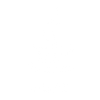
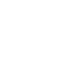
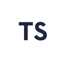
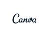
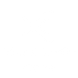
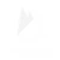
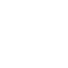
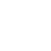

  

  &nbsp;
  &nbsp;
  &nbsp;
  &nbsp;
  

## Hey there! 👋
Creativity has always been a part of who I am. I’ve always been interested in art, visuals, and the way ideas can be expressed through design. At the same time, I discovered coding in high school, and I was amazed by how powerful it felt to build something from nothing. Seeing ideas come to life through code opened a whole new world for me, and it became something I genuinely enjoyed exploring. Now, as a fresh Computer Science graduate, I’m here pursuing the creative side of tech through UI/UX design and front-end development, where I can bring together my passion for design and the excitement I found in coding.

Here, you’ll find a collection of refactored college projects, projects I’ve worked on after graduation, and explorations in UI/UX research, design process, and visual thinking. This space reflects both my growth as a developer and my journey into the creative side of tech, showcasing the things I’ve built, improved, and continue to learn from along the way.

  

<table align="center">
  <tr>
    <td valign="top" width="50%" align="center">

### Programming Languages I've Worked With

  
  
  
    

  </td>
    <td valign="top" width="50%" align="center">

### Tools I've Used in the Past/Currently Using

  
  
  
  
  
  
  
  
  

  </td>
  </tr>
</table>
