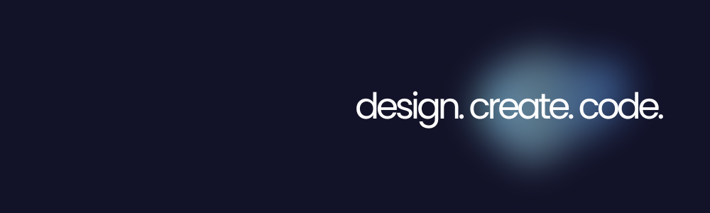

  

  <a href="https://your-portfolio-link.com">Portfolio</a> •
  <a href="https://www.linkedin.com/in/your-linkedin/">LinkedIn</a> •
  <a href="https://your-framer-link.com">Framer</a> •
  <a href="mailto:your@email.com">Email</a>

## Hey there! 👋
I’m a fresh Computer Science graduate with a long-standing passion for design, now exploring the creative side of tech through UI/UX design and front-end development.

  

### Tools I Use

  
  
  
  
  

